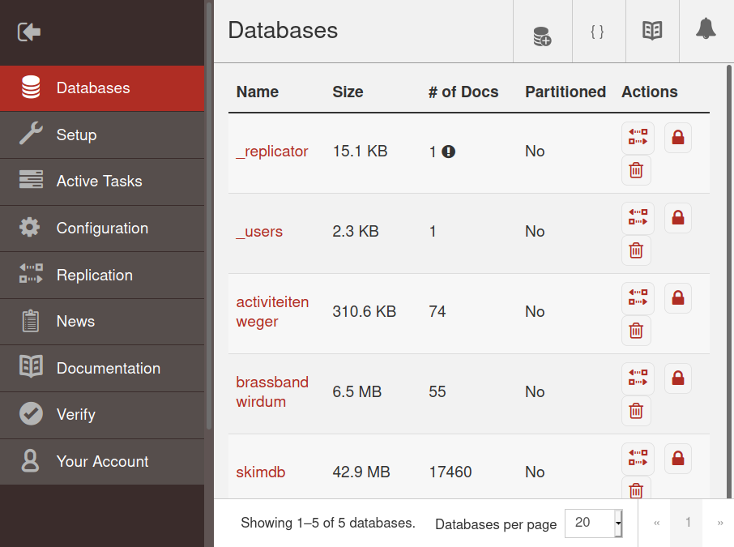

**TL;DR**: A tutorial for building a database that replicates like CouchDB in Python. Also introduces [ChairDB](https://github.com/marten-de-vries/chairdb).

# Introduction

## Why CouchDB?

Years ago, I first encountered [CouchDB](https://couchdb.apache.org/). Soon, I was hooked. CouchDB is a database that allows you to store and retrieve **JSON** documents through an **HTTP API**. If you have multiple installations, say on a server and your own computer, you can easily and quickly synchronize your database between them through a process called **replication**. On top of that, it allowed you to host your web application directly from your database using so-called **CouchApp**s[^couchapps]. It was amazing.

![Pages[^pages], a simple wiki implemented as a CouchApp.](img/couchapp.png)

At the time, I heavily used an application I developed for my personal use. It was hosted both by my laptop's and my web server's CouchDB. When I made a change on my laptop, either to the application itself or by entering some data, it would transparently push the change to the server and vice versa. If I did not have an internet connection[^internet], I could access the application locally. When at someone else's computer, I could access the application online. The same HTTP API that is used to keep two CouchDB databases in sync can also be used to get notified of every change to your database. This makes it easy to build applications that update in real-time when someone enters data, without having to reload. You simply listen to the '**changes feed**', and process updates as they come in. This was very nice compared to having to implement long polling in your own backend API. Also, you would get an admin interface for free. The cost was adhering to CouchDB's data model, but that was an acceptable trade-off.



[^couchapps]: See <https://github.com/couchapp/couchapp>. Sadly, the technique fell out of favour.
[^internet]: This was a while ago, clearly... Definitely before affordable mobile data plans.
[^pages]: Pages can be downloaded from: <https://github.com/couchone/pages>

## Alternative implementations

Skip forward a couple of years, and somehow this nice way of developing applications seemed to have mostly failed to achieve traction. Maybe because users don't like it if you ask them to install a database just to get your application working offline. Or perhaps developers don't like being that constrained on the server, e.g. when it comes to authentication[^passwordreset] and authorization[^authorization]. Still, the CouchDB ecosystem was active and evolving. You could **embed** a CouchDB-like database in your smartphone application using TouchDB[^touchdb] (nowadays [CouchDB-Lite](https://www.couchbase.com/products/lite)). And with the rise of JavaScript data storage APIs[^storage] in the browser came [PouchDB](https://pouchb.com/), which allows you to do the same inside a web application. I jumped on that and for a while worked on trying to port the (by now mostly abandoned) CouchApp paradigm over to it, culminating in [a demo](https://gist.github.com/marten-de-vries/3bfaf635f9efdbcf5102), which allowed you to run an existing CouchApp entirely from the user's disk with only minimal changes being necessary thanks to the then brand new [service workers](https://developer.mozilla.org/en-US/docs/Web/API/Service_Worker_API). But I never got around to extending '**PouchApps**' into a full-blown project without the rough edges.

[^passwordreset]: There was no way for a user to ask for a password reset, for example. See for a more thorough discussion [this blog post by Nolan Lawson](https://nolanlawson.com/2013/11/15/couchdb-doesnt-want-to-be-your-database-it-wants-to-be-your-web-site/) from 2013.
[^authorization]: For example, you can only restrict reading databases, not documents. This lead to [db-per-user workarounds](https://docs.couchdb.org/en/latest/config/couch-peruser.html) which come with downsides of their own.
[^touchdb]: iOS: <https://github.com/couchbaselabs/TouchDB-iOS>; Android: <https://github.com/couchbaselabs/TouchDB-Android>
[^storage]: First [WebSQL](https://www.w3.org/TR/webdatabase/). It was deprecated due to the specification essentially being 'do what [SQLite](https://www.sqlite.org) does'. These days, there's [IndexedDB](https://w3c.github.io/IndexedDB/).

Forwarding to today, CouchDB is still going strong, and currently in the process of [having its internals rewritten](https://blog.couchdb.org/2020/02/26/the-road-to-couchdb-3-0-prepare-for-4-0/) on top of [FoundationDB](https://www.foundationdb.org/). There's even ongoing work [to support document-level access control](https://github.com/apache/couchdb-documentation/pull/424/files). PouchDB has matured, and is a popular IndexedDB wrapper. The feature that sets it apart among those is replication.

## Goal

My aim so far has been to explain why I think CouchDB and its replication are interesting, and to show the state of the field. While I have been a long-time CouchDB user, I never got around to actually trying to understand how it and its replication work **from first principles**. When I recently decided to examine what so far had seemed like a magic trick, my first thought was to look at PouchDB's internals[^internals]. Sadly,  that alone was not enough. Partly, because PouchDB is a mature implementation which handles a lot of edge cases. Partly because its control flow is hard to follow, as it was written at a time when callbacks were still the only way of doing asynchronous control flow in JavaScript. To get the overview I decided to build my own minimal prototype of a CouchDB-compatible database, including replication, instead. This blog post summarizes my attempt to do so using the [Python programming language](https://www.python.org/).

Before we get to it, I should mention [Alexander Shorin previously embarked on a similar project](https://github.com/kxepal/replipy). In my opinion it oversimplifies conflict handling a bit, which comes at a cost to correctness, but it's an impressive resource worth checking out nonetheless. That project is what finally convinced me to give it a try myself. More recently, [Garren Smith wrote a mini-CouchDB in Rust](https://www.garrensmith.com/blogs/mini-couch-hack-week). That prototype isn't complete enough to support replication, but it gives a nice introduction to using FoundationDB like CouchDB will soon do. Very much worth a look as well!

[^internals]: See <https://github.com/pouchdb/pouchdb>. CouchDB's [source code](https://github.com/apache/couchdb-couch) is pretty accessible as well, but it's written in Erlang, which I cannot write and only somewhat read.

# Conflicts[^conflicts]

[^conflicts]: A more thorough discussion of conflicts can be found [in the CouchDB documentation](https://docs.couchdb.org/en/stable/replication/conflicts.html).

The first thing to figure out is how to represent documents and their metadata in our database[^no-attachments]. If you've used CouchDB, you know that each document has (at least) two special fields: '_id' and '_rev'. The first specifies the key under which the document is stored[^no-secondary] in the database. It's what you use to retrieve the document again. The second is short for 'revision'. A **revision** consists of two parts: an incrementing integer telling us the version of this document, and a hash of the document and all its metadata. For example: '``1-85a961d0d9b235b7b4f07baed1a38fda``'. In this prototype, we will not actually bother with calculating hashes: as long as they uniquely identify documents, that's good enough. Even PouchDB got away with using [random UUIDs](https://en.wikipedia.org/wiki/Universally_unique_identifier#Version_4_(random)) for [quite some time](https://github.com/pouchdb/pouchdb/issues/4642) without major issues. The revision is used to resolve conflicts. Let's walk through an example to understand how that works.

[^no-attachments]: For our prototype, we will ignore [attachments](https://docs.couchdb.org/en/stable/api/document/common.html#attachments), and focus on storing JSON documents only.
[^no-secondary]: We will also ignore secondary indexes (both CouchDB views and the newer Mango query server).


Imagine a municipality that keeps track of all the trees it plants in a database. In the morning, employee Bob comes along and plants a tree somewhere at a roadside. He dutifully updates the record for the current plot of land on his smartphone (revision '``1-1a9c``' gets replaced with '``2-e3b0``'), but as this is in a remote spot, the information is not synced to the municipality's server immediately. To make matters worse, his phone's battery dies before this can happen. While the phone is switched off, Jane reaches the same location with a second tree. She plants it, updates the database record (revision '``1-1a9c``' gets replaced with '``2-6e05``'), and goes on her way. Soon afterward, her phone syncs her changes to the server (which now also has '``2-6e05``' as its latest revision).

When Bob's phone is turned on again, it also replicates its record to the database. Contrary to what you might expect, this succeeds. But now the server has two versions of the same document: '``2-6e05``' and '``2-e3b0``'. This situation is called a **conflict**. If a user now requests the record for the roadside location, a CouchDB-like database will arbitrarily give them the one with the highest revision (the so-called '**winner**'). In this case, Bob's:

```python
>>> max('2-6e05', '2-e3b0')
'2-e3b0'
```


Clearly, this is unacceptable. If nothing were done, Jane's record update would be lost, through no fault of her own. This is why CouchDB's documentation recommends you either resolve conflicts on each read, or have a background process that watches for conflicts and resolves them. Let's say the municipality uses the latter approach. This background process then requests the two latest versions of the document. It creates a record which includes both of the newly planted trees, and replaces '``2-e3b0``' (Bob's revision) with a new revision '``3-5bd6``'. This doesn't yet resolve the conflict. For that, we also need to remove Jane's revision ('``2-6e05``') by replacing it with a new revision ('``3-b617``'). This revision marks the removal using an (otherwise empty) document with a '``_deleted``' field. Such a revision is called a '**tombstone revision**' in CouchDB terminology.

Note that if the background process had removed[^remove] Bob's revision ('``2-e3b0``') and stored the new revision as a continuation of Jane's revision ('``2-6e05``') instead, this also would have resolved the conflict. The point is that there should be at most one last revision that is not a tombstone revision[^conflictdeletion].

[^remove]: With 'remove' I mean replacing it with a tombstone revision. 'True' deletion is possible in CouchDB, but not recommended because it messes up replication. As such, this prototype will not implement [that operation](https://docs.couchdb.org/en/stable/api/database/misc.html#post--db-_purge). [Neither does PouchDB](https://github.com/pouchdb/pouchdb/issues/802), by the way.
[^conflictdeletion]: Incidentally, that also means that if you remove a document which has conflicts, it will not disappear. Instead, the conflict with the highest revision will be promoted to be the new 'winner'.

# Revision tree

The municipality story makes clear that just storing a revision per document isn't enough. If the background process doesn't tell the database which 'branch' to extend (Bob's or Jane's), the database cannot know which one to pick. In fact, the only logical solution from the database's perspective in such a situation would be to add the new record as another conflicting revision, making the problem worse.

Instead, CouchDB-like databases keep all previous revisions. The most efficient way to store this is in a tree structure called the '**revision tree**'. The revision tree for our municipality example was already given previously as a figure. Our example tree contains two ('last') **leaf nodes**, one of which is a tombstone revision, and has a single **root node**. To make sure revision trees don't increase in size indefinitely as data is added to the database, CouchDB-like databases implement two mechanisms:

1. **Compaction**. This removes all information about non-leaf nodes except their revision. In our example, that means that no information about the number of trees that are planted is kept except for the final record ('42 trees planted'). Compaction is the reason you should not rely on revisions as a history mechanism in CouchDB. If you require history information, you need to store it explicitly in each version of your document instead. To simplify our implementation, we design our data structures such that they can only store document information about the leaf node. This is equivalent to performing compaction immediately after each write.
2. **Revision pruning**. This removes old revisions from the revision tree. Only revisions that are separated from a leaf node less than **the revisions limit** are kept. By default the last 1000 revisions are kept, but this is configurable.

## Representation

With all that out of the way, it's time to get busy. Let's implement a revision tree. The easiest way is to implement it as a list of branches[^whynotree]. It makes the revision tree for the roadside record look like this in code:

[^whynotree]: Why a list of branches and not a real tree structure? I'm glad you asked. The short answer is that it makes a lot of the algorithms described here more complex. It was my initial approach, but I never got revision pruning to work that way. The code at that time [can be found here](https://github.com/marten-de-vries/chairdb/blob/bd35b4212e4acffa3a0442b273c2ea3ba1280060/microcouch/revtree.py). It's possible to do it I assume, but it's hard. To the point where CouchDB and PouchDB both convert their internal tree structure into something similar to the 'list of branches' representation used here and back again when doing revision pruning. A tree would definitely waste less memory, though.

```python
>>> bob_branch = Branch(leaf_rev_num=3, path=['5bd9', 'e3b0', '1a9c'],
...                     leaf_doc_ptr={'trees_count': 42})
>>> jane_branch = Branch(leaf_rev_num=3, path=['b617', '6e05', '1a9c'],
...                      leaf_doc_ptr=None)
>>> tree = RevisionTree([bob_branch, jane_branch])
```

You can see that we store, for each leaf, its revision number, the revision hashes of itself and all its ancestor nodes and the (user-supplied) document. If this is a tombstone revision, the document is None. ``Branch`` is simply a named tuple:

```python
import typing

class Branch(typing.NamedTuple):
    leaf_rev_num: int
    path: list
    leaf_doc_ptr: typing.Optional[dict]

    def index(self, rev_num):
        """Convert a revision number to a Branch.path index"""

        return self.leaf_rev_num - rev_num

```

The index method allows us to get the revision hash for a revision number. Let's verify it works:

```python
>>> jane_branch.path[jane_branch.index(rev_num=2)]
'6e05'
```

It does. Now what about ``RevisionTree``? We decided our ``RevisionTree`` representation is essentially a ``list`` (of branches), so let's inherit from that. If we keep the branches ordered by highest revision number and hash, that should make determining the winning revision easier later on.

```python
class RevisionTree(list):
    def __init__(self, branches):
        super().__init__(branches)

        # used to keep the tree sorted by leaf's revision number and hash
        self._keys = [self._by_max_rev(branch) for branch in self]

    def _by_max_rev(self, branch):
        # branch.path[0] is the leaf's revision hash
        return branch.leaf_rev_num, branch.path[0]
```

So far so good. Now let's implement some of the revision tree operations we discussed. First, finding the branch with the winning revision:

```python
def winner_idx(self):
    """Returns the index of the winning branch, i.e. the one with the
    highest leaf rev that isn't deleted. If no such branches exist, a
    deleted one suffices too.

    Assumption: branches are sorted already. (Longest branches & highest
    rev hashes last)

    """
    for i in range(len(self) - 1, -1, -1):
        if self[i].leaf_doc_ptr is not None:
            return i  # we have a non-deleted winner
    return len(self) - 1  # no non-deleted ones exist
```

Note that the loop iterates from the end of the list to the start. This means it iterates from the branch with the highest leaf revision to the branch with the lowest leaf revision. Let's make sure this correctly points to Bob's branch as the winner:

```python
>>> tree[tree.winner_idx()] == bob_branch
True
```

Useful. But what if we don't want to get just the winner, but want to find branches by revision? That's possible too:

```python
def find(self, rev_num, rev_hash):
    """Find the branches in which the revision specified by the arguments
    occurs.

    """
    for branch in self.branches():
        i = branch.index(rev_num)
        if 0 <= i < len(branch.path) and branch.path[i] == rev_hash:
            yield branch
```

Not so fast, what's this ``self.branches()`` thing? Well, it's a trivial method, but I gave it a name because it's very often useful:

```python
def branches(self):
    """All branches in the tree. Those with the highest revision number and
    hash first.

    """
    return reversed(self)
```

OK. We can now find out Bob's branch, knowing only the revision he added, as follows:

```python
>>> next(tree.find(2, 'e3b0')) == bob_branch
True
```

Success! One final method for querying the ``RevisionTree``. What if we want to iterate over all revisions in the tree? That might not sound useful now, but I promise we'll find a use for it when implementing replication later on:

```python
def all_revs(self):
    """All revisions in the tree as (branch, rev_num) tuples."""

    for branch in self.branches():
        for i in range(len(branch.path)):
            yield branch, branch.leaf_rev_num - i
```


## Updating the tree

Alright, by now we have a feel of what a revision tree looks like, but we need to figure out how to build one up incrementally.

What information is available during insertion? Well, definitely the new revision's revision number. We also talked about requiring one or more ancestor revision hashes next to the 'new' one. And of course we need the document contents. Oh, and finally this revision limit.

It turns out there are four possible cases during insertion. But our first function will only handle two of them itself:

1. The revision that we try to insert is already in the tree. That's easy: we simply do nothing.
2. The typical case that Jane and Bob experienced. They extended a previous revision ('``1-1a9c``') that was a leaf revision with one (or more) new revision(s): '``2-e3b0``' or '``2-6e05``', in their case.

The implementation is as follows. There are inline examples to understand how the
code handles both cases:

```python
def merge_with_path(self, doc_rev_num, doc_path, doc, revs_limit=1000):
    for i in range(len(self) - 1, -1, -1):
        branch = self[i]
        # 1. check if already in tree. E.g.:
        #
        # branch.leaf_rev_num = 5
        # branch.path = ['e', 'd', 'c']
        #
        # doc_rev_num = 3
        # doc_path = ['c', 'b', 'a']
        j = branch.index(doc_rev_num)
        if 0 <= j < len(branch.path) and branch.path[j] == doc_path[0]:
            return  # it is. Done.

        # 2. extend branch if possible. E.g.:
        #
        # branch.leaf_rev_num = 3
        # branch.path = ['c', 'b', 'a']
        # doc_rev_num = 5
        # doc_path = ['e', 'd', 'c', 'b']
        k = doc_rev_num - branch.leaf_rev_num
        if 0 <= k < len(doc_path) and doc_path[k] == branch.path[0]:
            full_path = doc_path[:k] + branch.path
            del self[i]
            del self._keys[i]
            self._insert_branch(doc_rev_num, full_path, doc, revs_limit)
            return  # it is. Done.

    # otherwise insert as a new leaf branch:
    self._insert_as_new_branch(doc_rev_num, doc_path, doc, revs_limit)

```

Note that for the typical case (2), we no longer need the 'old' branch, as it is completely incorporated into the 'extended' branch. That's the reason the ``del``ete statements are in there. There are some unfamiliar functions in this code block. We'll get to ``self._insert_as_new_branch`` soon, it implements the third and
fourth cases we talked about previously. But this is a good moment to introduce ``self._insert_branch``,
which creates a branch and inserts it in the location that maintains the tree ordering.

```python
import bisect

def _insert_branch(self, doc_rev_num, full_path, doc, revs_limit):
    # stem using revs_limit
    assert revs_limit > 0
    del full_path[revs_limit:]

    branch = Branch(doc_rev_num, full_path, doc)
    # actual insertion using bisection
    key = self._by_max_rev(branch)
    i = bisect.bisect(self._keys, key)
    self._keys.insert(i, key)
    self.insert(i, branch)
```

As you can see, revision pruning becomes a simple operation courtesy of our 'list of branches' approach. If you don't know about [bisect.bisect](https://docs.python.org/3/library/bisect.html), here's the short version: given a sorted list, it gives you the place to insert an item which will keep the list sorted. And it can do so efficiently without going through the whole list[^timecomplexity].

[^timecomplexity]: In $O(\log n)$ to be exact. But if you know about [Big O notation](https://en.wikipedia.org/wiki/Big_O_notation), I probably don't have to explain binary search in the first place.

That handles the simple cases. So what are those other two?

3. Conflict introduction. This occurs on the server. After Jane's phone syncs, the server only contains her tree. But when Bob's phone comes online, extending that tree will fail. After all, Jane's revision '``2-6e05``' isn't in 'his' branch. In this case, we could just insert Bob's branch as-is, but we don't *quite* do that. Instead, we check if we can find any common revisions in the past. The reason we do this is to make sure the revision information in the 'new' branch is as complete as we can make it. In this case it doesn't make any difference, but if a lazy user only supplies the bare minimum of ancestor revisions, it's useful.
4. It's possible that no common ancestors can be found. This probably occurs most frequently when the ``RevisionTree`` is still completely empty. We simply insert the new branch as-is in that case.

The code to handle these two more cases is as follows:

```python
def _insert_as_new_branch(self, doc_rev_num, doc_path, doc, revs_limit):
    for branch in self.branches():
        # 3. try to find common history
        start_branch_rev_num = branch.leaf_rev_num + 1 - len(branch.path)
        start_doc_rev_num = doc_rev_num + 1 - len(doc_path)
        maybe_common_rn = max(start_branch_rev_num, start_doc_rev_num)

        branch_i = branch.index(maybe_common_rn)
        doc_i = doc_rev_num - maybe_common_rn

        common_rev = (
            0 <= branch_i < len(branch.path) and
            0 <= doc_i < len(doc_path) and
            branch.path[branch_i] == doc_path[doc_i]
        )
        if common_rev:
            # success, combine both halves into a 'full_path'
            full_path = doc_path[:doc_i] + branch.path[branch_i:]
            break
    else:
        # 4. a new branch without shared history
        full_path = doc_path

    self._insert_branch(doc_rev_num, full_path, doc, revs_limit)
```

It's worth noting that I make use of a [for-else](https://docs.python.org/3/tutorial/controlflow.html#break-and-continue-statements-and-else-clauses-on-loops) loop here, because as far as I know that's a statement exclusive to Python. Anyway, that's all there is to the revision tree class. Let's try out our nice new merge method:

```python
>>> tree2 = RevisionTree([])
>>>
>>> # the initial situation, uses case 4.
>>> tree2.merge_with_path(1, ['1a9c'], {'trees_count': 40})
>>> print(tree2)
[Branch(leaf_rev_num=1, path=['1a9c'],
        leaf_doc_ptr={'trees_count': 40})]
>>>
>>> # Jane uploads her record, which uses case 2.
>>> tree2.merge_with_path(2, ['6e05', '1a9c'], {'trees_count': 41})
>>> print(tree2)
[Branch(leaf_rev_num=2, path=['6e05', '1a9c'],
        leaf_doc_ptr={'trees_count': 41})]
>>>
>>> # Bob uploads using case 3, which creates the conflict.
>>> tree2.merge_with_path(2, ['e3b0', '1a9c'], {'trees_count': 41})
>>> print(tree2)
[Branch(leaf_rev_num=2, path=['6e05', '1a9c'],
        leaf_doc_ptr={'trees_count': 41}),
 Branch(leaf_rev_num=2, path=['e3b0', '1a9c'],
        leaf_doc_ptr={'trees_count': 41})]
```

All seems to be in order. Next up, building a database out of the primitives we just wrote. The hardest part is behind us!


# An in-memory database

As this post tries to keep things simple, we won't worry about persisting data to disk. Instead, we'll build an in-memory database. For indexes, we use [sortedcontainers](http://www.grantjenks.com/docs/sortedcontainers/)'s [SortedDict](http://www.grantjenks.com/docs/sortedcontainers/sorteddict.html) type. This allows us to both efficiently iterate over keys in sorted order[^complexity1], and to quickly retrieve their associated values[^complexity2].

On the other hand, I will try to separate generic functions from 'memory database' specific functions, allowing you to re-use the former when working on a disk-backed database.

Time to introduce some more CouchDB concepts, just in case you haven't heard of them yet:

- **local documents**. These are documents to which the normal rules don't apply. They cannot be replicated and do not keep a revision tree. Every write overwrites whatever was stored under their '``_id``' previously. Because of this, we implement a separate index for them. They will also have their own specialized (but simpler) code.
- **update sequence**. This is a counter that keeps track of how many writes occurred in the database.
- **database id**. This is a string that uniquely identifies this database during replication. For an (ephemeral) in-memory database, using a random UUID is a pretty good choice, but we allow the user to change it.

[^complexity1]: With a time complexity of $O(n)$.
[^complexity2]: With a time complexity of $O(1)$.

With that out of the way, let's look at what our main class is going to look like[^sync]:

[^sync]: If you're wondering why I'm adding the word 'sync' everywhere, it'll be explained in due time.

```python
import uuid
import sortedcontainers

class SyncInMemoryDatabase:
    def __init__(self, id=None):
        self.id_sync = (id or uuid.uuid4().hex) + 'memory'
        self.update_seq_sync = 0
        self.revs_limit_sync = 1000

        # id -> document (dict)
        self._local = sortedcontainers.SortedDict()
        # id -> DocumentInfo
        self._byid = sortedcontainers.SortedDict()
        # seq -> id (str)
        self._byseq = sortedcontainers.SortedDict()
```

You see we have a the separate index for local documents, as promised. That leaves the other two. First, the '**by seq**' index maps the update sequence at the time of the last update to a document to that document's id. This allows us to reconstruct the order in which documents were updated. Replication needs that to keep track of what changed. But perhaps the most important index is the '**by id**' index[^indices]. It maps document IDs to a ``DocumentInfo`` object. Which is another named tuple type:

```python
class DocumentInfo(typing.NamedTuple):
    rev_tree: RevisionTree
    winning_branch_idx: int
    last_update_seq: int
```

You already know all about the revision tree. We cache the output of ``RevTree.winner_idx()`` after each write in the ``winning_branch_idx`` field for efficiency. Finally, ``last_update_seq`` is the same value that's used as key in the 'by sequence' index. We keep it around so we can remove old records from that index.

[^indices]: Curious how other implementations handle indices? I know I was. The on-disk (B+ tree) file format of [couchstore can be found here](https://github.com/couchbaselabs/couchstore/wiki/Format). It's similar to CouchDB's, I believe. A discussion of PouchDB's latest database schema [can be found here](https://github.com/pouchdb/pouchdb/pull/4984).

## Writing

Time to implement some methods[^self]. Let's start with adding documents to our database. To do so, we first need to pre-process the user's input, so let's write a function for that. This consists of extracting information we need, and cleaning up the document before insertion. The exact steps are:

1. extract the document ID (and remove it from the document)
2. extract the revision number, revision hash and ancestor revision hashes[^revisions] (and remove them from the document)
  - NB: a local document doesn't have any of those.
3. if this is an attempt to delete the document (tombstone revision), set the document to ``None``.

We then return the ID, the revision information (``None`` for a local document) and the cleaned up document.

[^self]: In the next few sections, every function that has '``self``' as its first argument is a method of the ``SyncInMemoryDatabase`` class.
[^revisions]: For the format of the ``_revisions`` field, see <https://docs.couchdb.org/en/stable/api/document/common.html#getting-a-list-of-revisions>.

```python
def prepare_doc_write(doc):
    """Normalize _revisions field & handle delete flag"""

    id = doc.pop('_id')
    if is_local(id):
        revs = None
    else:
        rev_num, rev_hash = parse_rev(doc.pop('_rev'))
        revs = doc.pop('_revisions', {'start': rev_num, 'ids': [rev_hash]})
        assert rev_num == revs['start'], 'Invalid _revisions'
        assert revs['ids'][0] == rev_hash, 'Invalid _revisions'
    if doc.get('_deleted'):
        doc = None
    return id, revs, doc

def is_local(id):
    return id.startswith('_local')

def parse_rev(rev):
    num, hash = rev.split('-')
    return int(num), hash
```

The user-facing API is actually pretty simple. We take a document, and store it returning nothing. As explained before, we create a separate code path for local documents:

```python
def write_sync(self, doc):
    id, revs, doc = prepare_doc_write(doc)
    if revs:
        self._write_normal(id, revs, doc)
    else:
        self._write_local(id, doc)
```

This separate code path just updates the key value store:

```python
def _write_local(self, id, doc):
    if doc is None:
        self._local.pop(id, None)  # silence KeyError
    else:
        self._local[id] = doc
```

The more interesting code path uses the revision tree logic we implemented previously:

```python
def _write_normal(self, id, revs, doc):
    try:
        tree, _, last_update_seq = self._byid[id]
    except KeyError:
        tree = None
    else:
        # update the by seq index by first removing a previous reference to
        # the current document (if there is one), and then (later)
        # inserting a new one.
        del self._byseq[last_update_seq]

    new_doc_info = update_doc(id, revs, doc, tree, self.revs_limit_sync)
    self.update_seq_sync += 1
    # actual insertion by updating the document info in the 'by id' index.
    self._byid[id] = DocumentInfo(*new_doc_info, self.update_seq_sync)
    self._byseq[self.update_seq_sync] = id
```

There's quite a bit going on here. Let's break it down. At this point, it's clear we're going to modify the database. So, we'll have to update both of the main indices. Our first step is to get the existing revision tree (if there is one) for this document ID. Soon, we'll overwrite it with a new one. We also remove the soon-to-be outdated entry in the 'by sequence' index.

After that's done, we update the revision tree to include the new revision. We'll get to the details of that soon. The important thing is that we get back a fresh revision tree and winning branch index from this process. The only thing left to do for us is to increment the 'update sequence', as the database has been modified, and to store the new values in the indices.

Alright, now that that's clear, let's go back to the part I glossed over:

```python
def update_doc(id, revs, doc, rev_tree, revs_limit):
    if rev_tree is None:
        rev_tree = RevisionTree([])  # new empty tree

    rev_tree.merge_with_path(revs['start'], revs['ids'], doc, revs_limit)
    return rev_tree, rev_tree.winner_idx()

```

It's not that complicated: we simply create a new revision tree if there wasn't one, and merge the user's new revision into the retrieved tree. Then we return the values we need in ``_write_normal``. All the real logic was already implemented previously.

And that's all there is to writing a document[^couchdb]. Let's try it out, playing out what happens on Jane's phone before syncing:

```python
>>> db = SyncInMemoryDatabase()
>>> db.write_sync({'_id': 'roadside', '_rev': '1-1a9c', 'tree_count': 40})
>>> db.write_sync({'_id': 'roadside', '_rev': '2-6e05', 'tree_count': 40,
                   '_revisions': {'start': 2, 'ids': ['6e05', '1a9c']}})
>>> db._byid['roadside'].rev_tree
[Branch(leaf_rev_num=2, path=['6e05', '1a9c'],
        leaf_doc_ptr={'tree_count': 40})]
```

So far so good. But that last line isn't a user-friendly way of reading documents at all. Let's implement a better API.

[^couchdb]: Actually, this is not the API CouchDB presents you by default. Instead, it's the one you get [when you use the 'new_edits=false' option](https://docs.couchdb.org/en/stable/api/document/common.html#put--db-docid). The 'normal' one tries to prevent you from inserting conflicts unnecessarily, and generates new revision numbers and hashes for you. But by now, you know enough about CouchDB's internal that you don't need for it to hold your hand. There are no fundamental limitations that prevent you from adding such behaviour, though.

## Reading

Probably the most common operation on a database is to read a document given the document ID. But as we've seen, there isn't necessarily a single document version. Instead, we allow the user to specify which version(s) they want to retrieve using a ``revs`` argument. It can have a couple of different values:

- ``'winner'``: in this case, we just return the winning revision's document. It's [what you get by default](https://docs.couchdb.org/en/stable/api/document/common.html#get--db-docid) in CouchDB if you request a document without any further information. Use with caution, because this can give unexpected results if there are conflicts.
- ``'all'``: in this case, we return all leaf revision documents. This may include tombstone revisions. The CouchDB equivalent is [setting ``open_revs``=``all``](https://docs.couchdb.org/en/stable/api/document/common.html#get--db-docid).
- a list of revisions. In this case, we return a document for each of the requested revisions. To be exact, we return the leaf document of the branch in which the revision occurs. Remember, we do not actually keep the document of old revisions around, like CouchDB does (for a while). Instead, it's like we're always using [CouchDB's latest=true option](https://docs.couchdb.org/en/stable/api/document/common.html#get--db-docid). The CouchDB equivalent for this ``revs`` value is also the ``open_revs`` option.

There is one final parameter to our read method. It's called ``include_path`` and tells us whether ancestor revisions should be included as a ``_revisions`` field of the returned document. This is useful during replication.

Phew. Who knew reading a document could get so complex? Time to look at the code:

```python
def read_sync(self, id, revs, include_path=False):
    try:
        if is_local(id):
            # load from the _local key-value store
            yield to_local_doc(id, revs, self._local[id])
        else:
            # find it using the 'by id' index
            rev_tree, winner, _ = self._byid[id]
            yield from read_docs(id, revs, include_path, rev_tree, winner)
    except KeyError as e:
        raise NotFound(id) from e
```

As you can see, it mostly just queries the indexes, and passes the result of
to other functions, before yielding their response. Why a ``yield``, and not a
``return``? Because when ``revs`` does not equal 'winner', multiple revisions
of the document might be returned. If the index doesn't contain a document, the
``NotFound`` exception is raised. That exception's definition is typical:

```python
class ChairDBError(Exception):
    """Base class for all custom errors."""

class NotFound(ChairDBError):
    """Something (a document or database, probably) doesn't exist."""
```

Now, let's first get the local document case out of the way. It isn't really that interesting, it's just a read from a key/value store after all. The biggest surprise is that we add a dummy '``_rev``' value to imitate CouchDB...

```python
def to_local_doc(id, revs, base):
    assert revs == 'winner'

    return {**base, '_id': id, '_rev': '0-1'}
```

Alright, time to get to the more difficult case of reading normal documents
from the revision tree. We first handle the 'winner' case. We can directly pull
the correct branch from the revision tree:

```python
def read_docs(id, revs, include_path, rev_tree, winning_branch_idx):
    if revs == 'winner':
        # winner information is passed in directly
        branch = rev_tree[winning_branch_idx]
        yield to_doc(id, branch, include_path)
    else:
        # ... walk the revision tree
        yield from read_revs(id, revs, rev_tree, include_path)
```

We'll ignore the other (``read_revs()``) cases for now, and look at ``to_doc`` first. It
reconstructs a CouchDB-style document given a branch. This mostly consists of
re-creating the revision information. If we're dealing with a tombstone
revision, we also need to represent that information as JSON.

```python
def to_doc(id, branch, include_path):
    doc = {'_id': id, '_rev': rev(branch, branch.leaf_rev_num)}
    if branch.leaf_doc_ptr is None:
        doc['_deleted'] = True
    else:
        doc.update(branch.leaf_doc_ptr)
    if include_path:
        doc['_revisions'] = {'start': branch.leaf_rev_num,
                             'ids': branch.path}
    return doc

def rev(branch, rev_num):
    return f'{rev_num}-{branch.path[branch.index(rev_num)]}'
```

Next, let's look at the cases where ``revs`` is not 'winner'. First, the 'all' case, which is easy thanks to our trusty ``RevisionTree.branches()`` method. And actually, the other case isn't much harder thanks to the ``RevisionTree.find()`` method we wrote previously. Although it does require us to perform some parsing: our API expects revisions in string format, but ``find()`` expects a revision number and revision hash.

```python
def read_revs(id, revs, rev_tree, include_path):
    if revs == 'all':
        # all leafs
        for branch in rev_tree.branches():
            yield to_doc(id, branch, include_path)
    else:
        # search for specific revisions
        for rev in revs:
            for branch in rev_tree.find(*parse_rev(rev)):
                yield to_doc(id, branch, include_path)
```

And that's it. It's everything you need to read from a CouchDB. You might notice that we didn't implement [a lot of options supported by CouchDB](https://docs.couchdb.org/en/stable/api/document/common.html#get--db-docid). That's because you don't need them during replication or casual use. Most of the remaining options are either attachment-related (which we don't implement), convenience options for users, or expose more internal information to the caller.

Anyway, let's read back the (single) document we just wrote to the database as a quick
test:

```python
>>> list(db.read_sync(id='roadside', revs='all', include_path=True))
[{'_id': 'roadside', '_rev': '2-6e05', 'tree_count': 40,
  '_revisions': {'start': 2, 'ids': ['6e05', '1a9c']}}]
```

It works! Much better than manually deciphering the 'by id' index.

## Replication requirements

By now we can read and write documents. But the replication process needs two more endpoints. Luckily, they are simpler to add.

First, as previously discussed, the replication process needs to have a record of all the changes that were made to the database. This record is the reason why we keep the 'by sequence' index, which we expose to the user through the [changes feed API](https://docs.couchdb.org/en/stable/api/database/changes.html). This API has many options, but we limit it to the bare minimum required for replication. That includes implementing the endpoint such that it gives us all leaf revs (the non-default ``style='all_docs'`` option).

```python
def changes_sync(self, since=None):
    for seq in self._byseq.irange(minimum=since, inclusive=(False, False)):
        id = self._byseq[seq]
        rev_tree, winner, _ = self._byid[id]
        yield build_change(id, seq, rev_tree, winner)
```

Alright, that's doable. The user can specify from which update sequence to start listing all database changes[^irange], and then we get the document information for each of these changes. The only thing left is to give this information back to the user in a structure close to what CouchDB returns:

[^irange]: Thanks to ``SortedDict``'s [``irange`` method](http://www.grantjenks.com/docs/sortedcontainers/sortedlist.html#sortedcontainers.SortedList.irange).

```python
def build_change(id, seq, rev_tree, winning_branch_idx):
    winning_branch = rev_tree[winning_branch_idx]
    deleted = winning_branch.leaf_doc_ptr is None
    leaf_revs = [rev(b, b.leaf_rev_num) for b in rev_tree.branches()]
    return Change(id, seq, deleted, leaf_revs)

class Change(typing.NamedTuple):
    """A representation of a row in the _changes feed"""

    id: str
    seq: int
    deleted: bool
    leaf_revs: list
```

You might be interested to see the result of running this on Jane's database:

```python
>>> list(db.changes_sync())
[Change(id='roadside', seq=2, deleted=False, leaf_revs=['2-6e05'])]
```

Looks good. Note that the previous edit of the 'roadside' record isn't shown. This is by design: recall how we removed old entries from the 'by sequence' index.

Now let's implement our final end point: the revision difference reporter. Given a document ID and a list of revisions, it tells us which of those revisions are unknown to the database. This is where the ``all_revs()`` method comes in. But I'm getting ahead of myself. First, we need to get the revision tree for the id:

```python
def revs_diff_sync(self, id, revs):
    try:
        rev_tree = self._byid[id].rev_tree
    except KeyError:
        rev_tree = None
    return revs_diff(id, revs, rev_tree)
```

Once we have it, we extract from it all known revisions for this document ID. Note that if there is no revision tree, there are *no* known revisions in the database.

```python
def revs_diff(id, revs, rev_tree):
    if rev_tree:
        revs_in_db = (rev(*r) for r in rev_tree.all_revs())
    else:
        revs_in_db = ()
    return id, {'missing': set(revs).difference(revs_in_db)}
```

Finally, we compare the list of revisions given by the caller with the list of
revisions known to be in the database. This returns all the unknown revisions
on the user's list using a set difference operation. Note that because these
are set operations, it doesn't matter if revisions occur more than once in
either of the lists.

Using this endpoint looks like this:

```python
>>> list(db.revs_diff_sync('roadside', revs=['3-unknown', '2-6e05']))
['roadside', {'missing': {'3-unknown'}}]
```

As you'd expect, only the unknown revision is returned. We now have all the
elements in place to move our attention to the replication process itself.


# Replication

A **replicator** is an implementation of the [CouchDB replication protocol](https://docs.couchdb.org/en/stable/replication/protocol.html). This is a process that relies only on the user-facing APIs we just designed. In fact, you could wrap up the methods we just wrote in an HTTP API, and CouchDB's replicator would be able to sync databases to and from it. So would PouchDB's replicator. This is something I did in fact do while working on this project, because it's a great way to test it. Which brings me to...

## Intermezzo: testing


This post makes it seem like I wrote all this code down at once. That's not the case, I experimented quite a bit before eventually settling on this design. It might be interesting to know a bit about my work process here.

As I just explained, I wrapped the API inside a CouchDB-compatible HTTP API so I could test it using CouchDB's replicator. There is a relatively straight-forward mapping between the two. What I did not yet explain is that you only need to implement a subset of the API to perform one-way replication. For example, if you implement just the ``id_sync``, ``update_seq_sync``, ``changes`` and ``read`` properties/methods, that's enough for CouchDB to replicate data from your database into a database on its own. Similarly, to replicate data from some database to your own, you only need to implement ``id_sync``, ``revs_diff_sync`` and ``write_sync``. As you can see, this nicely divides the amount of work you need to do into about half.

While simply using CouchDB's replicator to replicate a couple of databases I had lying around back and forth provided the bulk of the testing, I also wrote a couple of unit tests, mostly targeting ``RevisionTree``. They are quite similar to the inline snippets you've seen throughout this post that demonstrate what individual functions can do[^bug].

[^bug]: It so happens to be that writing the snippets for this blog post led me to discover a (now fixed) bug.

Finally, while writing my own replicator, I noticed that it would also be convenient if that replicator could receive changes from a remote (HTTP) CouchDB, without having to expose its own HTTP API. That way, I could test my own replicator instead of CouchDB's. My solution was to wrap the CouchDB HTTP API into the same API as we just wrote. There's one problem though: HTTP requests can be slow. There are two possible solutions. The first is the most mature one: just throw a thread pool at the problem. But I thought this would be a good moment for me to try out Python's comparatively recent [``asyncio`` ecosystem](https://docs.python.org/3/library/asyncio.html) instead. I'd been wanting to do so for some time, anyway.

## Asynchronous database API

The first step was to define an asynchronous API for the database. Just to be clear: this is lunacy for an in-memory database on its own. Almost by definition, such a database is synchronous. But it makes some sense when wrapping the CouchDB HTTP API. After all, the CouchDB database in question could be hosted at the other side of the planet, introducing some real latency to the process.

In the end, I implemented the asynchronous API for the in-memory database for code that requires compatibility with async implementations. This way, I could run the new replicator against both CouchDB and in-memory databases. But I also exposed the synchronous API for code that does not need that compatibility. Let's go through this wrapper code.

```python
import asyncio

class InMemoryDatabase(SyncInMemoryDatabase):
    def __init__(self, *args, **kwargs):
        super().__init__(*args, **kwargs)

        self._update_event = asyncio.Event()

    def _write_normal(self, *args, **kwargs):
        super()._write_normal(*args, **kwargs)

        self._update_event.set()
        self._update_event.clear()

    async def changes(self, since=None, continuous=False):
        """"Like CouchDB's _changes with style=all_docs"""

        while True:
            # send (new) changes to the caller
            for change in self.changes_sync(since):
                since = change.seq
                yield change

            if not continuous:
                # stop immediately.
                break
            # wait for new changes to come available, then loop
            await self._update_event.wait()
```

I thought I'd start with the only part that arguably isn't *just* a wrapper. We
introduce an [``asyncio.Event``](https://docs.python.org/3/library/asyncio-sync.html#asyncio.Event) that we set whenever the database is modified. This allows us to implement [the continuous option](https://docs.couchdb.org/en/stable/api/database/changes.html#continuous) of the changes feed. When this option is True, the ``changes()`` function never returns but will instead block until a new change is available. The replicator can use this to implement **continuous replication**, which means that a change will be replicated over immediately as it is entered into the database.

The other wrapper methods are simpler. The most complex ones are arguably the ``read`` and ``write`` methods, which support reading or writing multiple documents with a single call. That'll come in handy while writing the replicator, as it's supported by CouchDB as well.

```python
@property
def id(self):
    return as_future_result(self.id_sync)

@property
def update_seq(self):
    return as_future_result(self.update_seq_sync)

async def revs_diff(self, remote):
    async for id, revs in remote:
        yield self.revs_diff_sync(id, revs)

async def write(self, docs):
    async for doc in docs:
        try:
            self.write_sync(doc)
        except Exception as exc:
            yield exc

async def read(self, requested, include_path=False):
    async for id, revs in requested:
        try:
            for doc in self.read_sync(id, revs, include_path):
                yield doc
        except NotFound as exc:
            yield exc

async def ensure_full_commit(self):
    pass

@property
def revs_limit(self):
    return as_future_result(self.revs_limit_sync)

async def set_revs_limit(self, value):
    self.revs_limit_sync = value
```

Ah, I forgot to describe two things. First of all, there is a new method called ``ensure_full_commit``. It's there because the replication protocol requires it, but for an in-memory implementation, it's a no-op. You might also wonder what ``as_future_result`` does. It's a way of making synchronous properties awaitable. The implementation is as follows:

```python
def as_future_result(value):
    future = asyncio.get_event_loop().create_future()
    future.set_result(value)
    return future
```

## Replicator implementation

Now that we have a unified API, we can work on the actual replicator. Replication has four inputs:

- the ``source`` database, changes from here are also applied to...
- the ``target`` database
- ``create_target``: a boolean that tells us whether to create the target database if it's not there. This is mostly a HTTP API artifact, but we support it by implementing an ``async create(self) -> bool`` method on the HTTP database. Of course, an in-memory database will always exist when passed in, so no such method is necessary in that case. This also requires the HTTP database to raise a ``NotFound`` error when the database doesn't exist.
- ``continuous``: a boolean that tells us whether to stop replication when the target DB contains all documents in the source DB, or whether to stay active waiting for new changes to arrive.

Bidirectional replication, which is also known as synchronization, is nothing more than two unidirectional replication jobs running simultaneously with exchanged 'source' and 'target' roles.

We define the replicator as a single function. This function is long. As such, we will discuss it in multiple parts, sometimes interleaved with the functions it calls itself. While reading this section, I recommend having the [replication protocol documentation](https://docs.couchdb.org/en/stable/replication/protocol.html) open. It gives examples for each part of the process, and the code comments refer to its sections.

```python
import uuid

REPLICATION_ID_VERSION = 1


async def replicate(source, target, create_target=False, continuous=False):
    hist_entry = {'session_id': uuid.uuid4().hex,
                  'start_time': timestamp(),
                  'doc_write_failures': 0,
                  'docs_read': 0}

    # 2.4.2.1. Verify Peers & 2.4.2.2. Get Peers Information
    #  2.4.2.1.1. Check Source Existence & 2.4.2.2.1. Get Source Information
    await source.update_seq

    #  2.4.2.1.2. Check Target Existence & 2.4.2.2.2. Get Target Information
    last_seq = await get_target_seq(target, create_target)
    hist_entry['start_last_seq'] = last_seq
```

A good start. We store some information about how the replication process goes in ``hist_entry``. We also generate a unique replication session identifier. As an aside, ``timestamp`` is implemented as follows:

```python
import email.utils

def timestamp():
    return email.utils.format_datetime(email.utils.localtime())
```

Apart from that, we check whether both databases exist by requesting their ``update_seq``. In the case of the target database, we create it as necessary:

```python
async def get_target_seq(target, create_target):
    try:
        return await target.update_seq
    except NotFound:
        # 2.4.2.1.3. Create Target?
        if create_target:
            await target.create()
            # second chance
            return await target.update_seq
        # 2.4.2.1.4. Abort
        raise
```
OK, so by now both databases exist. We first want to know if replication has already occurred previously between these databases by generating a replication ID:

```python
    # 2.4.2.3. Find Common Ancestry
    # - 2.4.2.3.1. Generate Replication ID
    replication_id = await gen_repl_id(source, target, create_target,
                                       continuous)
```

``gen_repl_id`` simply hashes all information known about this replication job:

```python
import hashlib

async def gen_repl_id(source, target, create_target, continuous):
    # 2.4.2.3.1. Generate Replication ID
    repl_id_values = ''.join([
        await source.id,
        await target.id,
        str(create_target),
        str(continuous),
    ]).encode('UTF-8')
    return hashlib.md5(repl_id_values).hexdigest()
```

Next, we query both databases for local documents named after this replication id, which gives us the previous replication logs (if any). We compare them to see if they agree previous replication occurred. If so, we found a so-called **checkpoint**. This means we can start replication from the ``update_seq`` that was at the time the last one (stored in ``startup_checkpoint``):

```python
# - 2.4.2.3.2. Retrieve Replication Logs from Source and Target
log_id = f'_local/{replication_id}'
log_request = [(log_id, 'winner')]
source_log = await source.read(async_iter(log_request)).__anext__()
target_log = await target.read(async_iter(log_request)).__anext__()

# - 2.4.2.3.3. Compare Replication Logs
startup_checkpoint = compare_replication_logs(source_log, target_log)
hist_entry['recorded_seq'] = startup_checkpoint
```

``compare_replication_logs`` does the actual hard work:

```python
def compare_replication_logs(source, target):
    # 2.4.2.3.3. Compare Replication Logs
    no_checkpoint = (
        # because there is no record of a previous replication
        isinstance(source, NotFound) or
        isinstance(target, NotFound) or
        # or because said replication happened under different (possibly
        # buggy) conditions
        source['replication_id_version'] != REPLICATION_ID_VERSION or
        target['replication_id_version'] != REPLICATION_ID_VERSION
    )
    if no_checkpoint:
        return
    if source['session_id'] == target['session_id']:
        return source['source_last_seq']  # shortcut

    # try to find commonality in diverging histories:
    session_ids = {item['session_id'] for item in source['history']}
    for item in target['history']:
        if item['session_id'] in session_ids:
            # found a previous shared session
            return item['recorded_seq']
    # no such luck: there's no known checkpoint.
```

At this point, we either need to get all the changes from the source database or the changes since the last checkpoint. Note that the changes() function is an async generator function. That means it only generates changes when requested. For a while, no changes will be retrieved yet. We'll see that applies to a lot more functions.

```python
# 2.4.2.4. Locate Changed Documents
# - 2.4.2.4.1. Listen to Changes Feed
# - 2.4.2.4.2. Read Batch of Changes
changes = source.changes(since=startup_checkpoint, continuous=continuous)
diff_input = revs_diff_input(changes, hist_entry)
```

The ``revs_diff_input`` function converts ``Change``s into IDs and revisions as expected by the ``_revs_diff`` method on the target database. It also keeps our history entry up-to-date. Note that this is another async generator function.

```python
async def revs_diff_input(changes, history_entry):
    async for change in changes:
        yield change.id, change.leaf_revs
        history_entry['recorded_seq'] = change.seq
```

```python
# - 2.4.2.4.3. Calculate Revision Difference
r_input = read_input(target.revs_diff(diff_input))
```

Next up, ``revs_diff`` will tell us which documents to read from the source database because they aren't in the target database. This again requires transforming the results slightly to match the ``read()`` function's input. Note that at this point, still nothing is actually happening because of all the async generators.


```python
async def read_input(revs_diff):
    async for id, info in revs_diff:
        if info['missing']:
            yield id, info['missing']
```

```python
# 2.4.2.5. Replicate Changes
#  - 2.4.2.5.1. Fetch Changed Documents
write_input = count_docs(source.read(r_input, include_path=True),
                         hist_entry)
```

All documents that were read from the source database now need to be inserted into the target database. This time, no conversion is necessary, but we still pipe them through an extra async generator function ``count_docs`` to keep our ``history_entry`` up-to-date:

```python
async def count_docs(docs, history_entry):
    async for doc in docs:
        history_entry['docs_read'] += 1
        yield doc
```

... before performing the actual write action. Note that this is the point at which all the generator functions start running. So this is the point at which the first change is retrieved, analysed by the revisions difference reporter, then read from disk and finally written. All in a single stream. This isn't actually strictly according to the protocol, which requires batching as it was written with an HTTP API in mind. For in-memory databases this is a nice and clear way of doing things, though. The HTTP implementation of the database API could work around this by performing batching internally, but that isn't fully implemented at the moment.

```python
# - 2.4.2.5.2. Upload Batch of Changed Documents
async for error in target.write(write_input):
    # - 2.4.2.5.3 TODO (attachments)
    hist_entry['doc_write_failures'] += 1
```

It's also worth mentioning that when performing continuous replication, none of the code we will discuss next is currently run, because this loop stays blocked waiting for new changes. Ideally, it would write a checkpoint every few changes instead. But this will do for demonstration purposes.

We're done writing. The following ensures all the writes we did are saved to disk, at least for 'normal' (not memory-based) CouchDB installations:

```python
# -  2.4.2.5.4. Ensure In Commit
await target.ensure_full_commit()
```

One thing left to officially complete the replication process: merging the history entry with previous replication logs and replacing these logs in the local documents so future replicator calls have a checkpoint to start from. We do that as follows:

```python
# - 2.4.2.5.5. Record Replication Checkpoint
hist_entry['end_time'] = timestamp()
write_count = hist_entry['docs_read'] - hist_entry['doc_write_failures']
hist_entry['docs_written'] = write_count
hist_entry['end_last_seq'] = hist_entry['recorded_seq']
new_log_shared = {
    'replication_id_version': REPLICATION_ID_VERSION,
    'session_id': hist_entry['session_id'],
    'source_last_seq': hist_entry['recorded_seq'],
}
if hist_entry['recorded_seq'] != startup_checkpoint:
    new_source_log = {'history': build_history(source_log, hist_entry),
                      '_id': log_id, **new_log_shared}
    new_target_log = {'history': build_history(target_log, hist_entry),
                      '_id': log_id, **new_log_shared}

    await to_list(source.write(async_iter([new_source_log])))
    await to_list(target.write(async_iter([new_target_log])))
```

The ``build_history`` function inserts the history entry into the existing log, throwing away the oldest replication statistics to prevent the log from growing too large:

```python
def build_history(existing_log, new_entry):
    try:
        existing_history = existing_log['history']
    except TypeError:
        return [new_entry]
    else:
        return [new_entry] + existing_history[:4]
```

You might wonder what ``async_iter`` and ``to_list`` are doing. They are small functions that help you use the async API without writing async loops or having async input:

```python
async def async_iter(iterable):
    for item in iterable:
        yield item


async def to_list(asynciterable):
    return [x async for x in asynciterable]

```

Finally, we return the replication statistics to the caller:

```python
# - 2.4.2.4.4. Replication Completed
return {
    'ok': True,
    'history': [hist_entry],
    **new_log_shared,
}
```

... and that's all there is to it! Let's come back to our municipality example
one last time and completely simulate what happens.

First, we set up the initial situation by creating databases for the server, Jane and Bob, and inserting the 'original' document to the server. We replicate this change to the databases of both Jane and Bob:

```python
>>> server_db = InMemoryDatabase()
>>> jane_db = InMemoryDatabase()
>>> bob_db = InMemoryDatabase()
>>>
>>> server_db.write_sync({'_id': 'roadside', '_rev': '1-1a9c',
... 'trees_count': 40})
>>> await replicate(source=server_db, target=jane_db)
{'ok': True, ..., 'source_last_seq': 1}
>>> await replicate(source=server_db, target=bob_db)
{'ok': True, ..., 'source_last_seq': 1}
```

Now, Bob plants a tree, but doesn't get the chance to replicate his change yet.

```python
>>> bob_db.write_sync({'_id': 'roadside', '_rev': '2-e3b0',
... 'trees_count': 41, '_revisions':
... {'start': 2, 'ids': ['e3b0', '1a9c']}})
```

Jane also plants a tree, but replicates immediately:

```python
>>> jane_db.write_sync({'_id': 'roadside', '_rev': '2-6e05',
... 'trees_count': 41, '_revisions':
... {'start': 2, 'ids': ['6e05', '1a9c']}})
>>> await replicate(source=jane_db, target=server_db)
{'ok': True, ..., 'source_last_seq': 2}
```

Now Bob comes back online and also replicates:

```python
>>> await replicate(source=bob_db, target=server_db)
{'ok': True, ..., 'source_last_seq': 2}
```

The background process responsible for fixing the conflict is listening to the changes feed and notices that there is now (possibly) a conflict:

```python
>>> for change in server_db.changes_sync():
...     print(change)
...
Change(id='roadside', seq=3, deleted=False, leaf_revs=['2-e3b0', '2-6e05'])
```

It retrieves the conflicting leaves:

```python
>>> for doc in server_db.read_sync('roadside', 'all', include_path=True):
...     print(doc)
...
{'_id': 'roadside', '_rev': '2-e3b0', 'trees_count': 41,
 '_revisions': {'start': 2, 'ids': ['e3b0', '1a9c']}}
{'_id': 'roadside', '_rev': '2-6e05', 'trees_count': 41,
 '_revisions': {'start': 2, 'ids': ['6e05', '1a9c']}}
```

... and fixes the conflict using two writes:

```python
>>> server_db.write_sync({'_id': 'roadside', '_rev': '3-b617',
... '_deleted': True, '_revisions':
... {'start': 3, 'ids': ['b617', '6e05', '1a9c']}})
>>> server_db.write_sync({'_id': 'roadside', '_rev': '3-5bd6',
... 'trees_count': 42, '_revisions':
... {'start': 3, 'ids': ['5bd6', 'e3b0', '1a9c']}})
```

To make sure all the databases are again in sync, we also replicate the changes to the smartphones of Jane and Bob:

```python
>>> await replicate(source=server_db, target=jane_db)
{'ok': True, ..., 'source_last_seq': 5}
>>> await replicate(source=server_db, target=bob_db)
{'ok': True, ..., 'source_last_seq': 5}
```

Let's check if that worked:

```python
>>> next(jane_db.read_sync('roadside', 'winner'))
{'_id': 'roadside', '_rev': '3-5bd6', 'trees_count': 42}
>>> next(bob_db.read_sync('roadside', 'winner'))
{'_id': 'roadside', '_rev': '3-5bd6', 'trees_count': 42}
```

Success!

# Conclusion

It surprised me that replication itself is actually a relatively straight-forward process once you have all the endpoints in place. When I started out, I also expected coming up with the right indices to be the most complex part of this experiment. Clearly, I underestimated the complexity of working with the revision tree. Most of my time was actually spend on getting that correct (hopefully!).

## Extending the prototype: ChairDB

While the above is a full implementation of a CouchDB-compatible database and replication, you might be interested to see the HTTP API and CouchDB database wrapper I described in the testing section. The former is implemented using the [Starlette web framework](https://www.starlette.io/). The latter uses the excellent [HTTPX library](https://www.python-httpx.org/). Both can be found in my [ChairDB repository](https://github.com/marten-de-vries/chairdb). It also includes a database implementation on top of SQLite, in case you (rightfully) think an in-memory database doesn't cut it. Finally, it contains all the tests I wrote. I'm not yet certain if I will continue to work on ChairDB. Perhaps.

## Final words

If you read this far, **congratulations**! You now know how to write a CouchDB-compatible database, including replication. If you write one of your own, or if you have any remarks, comments or questions, I'd love to hear from you. [Drop me an email](mailto:m@rtendevri.es). Thank you for reading!

---

```bash
(venv) marten@procyon:~/Bureaublad/couch/chairdb$ cloc replicate.py
    db/memory.py db/revtree.py db/datatypes.py db/shared.py --md
```
**count lines of code | github.com/AlDanial/cloc v 1.82**

Language|files|blank|comment|code
:-------|-------:|-------:|-------:|-------:
Python|5|161|175|365
